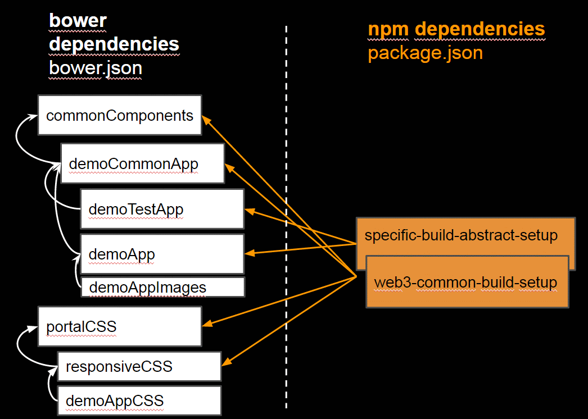

* <a href="#quicksetup">Setup</a>
    *  <a href="#prequisites">Prequisites</a>
    * <a href="#installanduse">Install & Use</a>
    * <a href="#proxy">Proxy Settings</a>
* <a href="#about">About</a>

#<a name="quicksetup">Setup</a>

##<a name="prequisites">Prequisites</a>
### Installed
node, npm, git, bower, gulp
### Executables in global env path
git, bower, gulp
### Set environment variable
NODE_PATH=<path_to_local_user_repo>/node_modules
### Optional ( do later if you know what to do)
See npm faq <a href="https://docs.npmjs.com/faq">here</a>

To Change node_modules folder: 

npm config --global set prefix %NODE_PATH%/npm_packages
npm config --global set cache %NODE_PATH%/npm-cache

or

create a .npmrc in the folder of your app, or in one of their parents folders

and

copy your node_modules to this new folder

there also exist the usage of 

npm install --prefix anotherPathTo_node_modules

for **bower specific settings** you can also do the same with the .bowerrc 

{
    "proxy":"http://myproxy:1111",
    "https-proxy":"http://myproxy:1111",
	"storage": {
		"packages" : "C:/repository/.bower/cache",
		"registry" : "C:/repository/.bower/registry",
		"links" : "C:/repository/.bower/links",
		"empty" : "C:/repository/.bower/empty"
	},
	"tmp": "C:/tmp/.bower"
}

###<a name="proxy">Proxy Settings if needed</a>

Set environment variable

HTTP_PROXY=http://myproxy:1111

HTTPS_PROXY=http://myproxy:1111

npm config set proxy http://myproxy:1111

npm config set https-proxy http://myproxy:1111

git config --global url."https://".insteadOf git://

To have git working with your projects, unset proxy in all of your git projects, add a .gitconfig in the folder where npm install is executed,
or set and unset it globally:

git config --global http.proxy http://myproxy:1111

git config --global https.proxy http://myproxy:1111

git config --global --unset http.proxy

git config --global --unset https.proxy

##<a name="installanduse">Install & use web3-common-build-setup</a>
1. **Global locale repository installation**
    
npm install -g https://github.com/dabbank/web3-common-build-setup/archive/0.3.0.tar.gz

2. **Windows-Workaround** 
( install nested dependencies of web3-common-build-setup):

    
cd %NODE_PATH%/web3-common-build-setup

    npm install
    
(run 1-2 times. errors can be ignored)

    
3.
3. **Run your app**
    
( see <a href="https://github.com/dabbank/web3-build-template-demo-apps/tree/master/demo-simple-app-page">dab-simple-app-page</a> for acceptance tests & integration tests & example of bower.json, package.json gulpfile.js to copy)

   * npm init
   * npm install -D web3-common-build-setup
   * bower init
   * bower install lodash-compat -D
   * copy gulpfile.js skeletton ( from simple-app)
   * define your libs to be used
   
CONFIG.SRC.JS.LIBS = function() {
    return ["bower_components/lodash-compat/lodash.js"];
   };

   * gulp
    
→  browser should start up automatically

    

4. **Optional**
   To implement with npm modules, you should register them local with
   
npm link

   and use the linked npm with e.g.
   
npm link web3-common-build.setup

#<a name="about">About</a>

# Why ?
Composite ( think of Object Oriented) build setup,
to start projects very quick, without scaffolding
and supporting multi module management with TypeScript & Angular.js

# TODOS
see TODO reference
https://docs.google.com/presentation/d/1fsZw-xODbVgovIMJAmZdxAgjOqU4LQ7Sb7pEW6c-YF8/edit?usp=sharing

see project clone by Christian:
https://github.com/psi-4ward/gulpsi/

