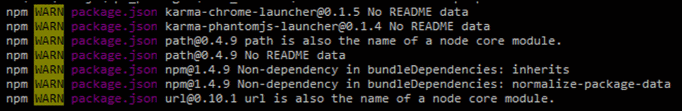
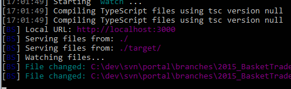

# web3-common-build-setup
**Starter Template based on gulp for enterprise size projects**

and documentation about best TypeScript, Angular.js, and modularization

##<a name="about">About</a>

## Why ?
Composite ( think of Object Oriented) build setup,
to start projects very quick, without scaffolding
and supporting multi module management with TypeScript & Angular.js


* <a href="#highlights">Highlights</a>
* <a href="#quicksetup">Setup</a>
    * <a href="#prequisites">Prequisites</a>
    * <a href="#installanduse">Install & Use</a>
    * <a href="#proxy">Proxy Settings</a>
* <a href="#todos">TODOS</a>
    * <a href="#todos_documentation">Documentation</a>
    * <a href="#todos_installation">Installation</a>
    * <a href="#todos_installation">Reuse</a>
    * <a href="#todos_modularization">Modularization</a>
    * <a href="#todos_missing_features">Missing Features</a>
    * <a href="#todos_bugs">Bugs</a>


## <a name="highlights">Highlights</a>
* composite build setup with modularization ideas based on node.js, gulp, bower, npm, TypeScript
* sass by node, not ruby & compass
* node bundled selenium & chromedriver
* ...


##<a name="quicksetup">Setup</a>

###<a name="prequisites">Prequisites</a>
#### Installed
node, npm, git, bower, gulp
#### Executables in global env path
git, bower, gulp
#### Set environment variable ( seems to be needed, @TODO: check why)
```Batchfile
NODE_PATH=<path_to_local_user_repo>/node_modules
```

#### <a name="optionalsetup">Optional Setup</a> ( do later if you know what to do)
See npm faq <a href="https://docs.npmjs.com/faq">here</a>

To Change node_modules folder: 

npm config --global set prefix %NODE_PATH%/npm_packages
npm config --global set cache %NODE_PATH%/npm-cache

or

create a .npmrc in the folder of your app, or in one of their parents folders

and

copy your node_modules to this new folder

there also exist the usage of 

npm install --prefix anotherPathTo_node_modules

for **bower specific settings** you can also do the same with the .bowerrc 

```Batchfile
{
    "proxy":"http://myproxy:1111",
    "https-proxy":"http://myproxy:1111",
	"storage": {
		"packages" : "C:/repository/.bower/cache",
		"registry" : "C:/repository/.bower/registry",
		"links" : "C:/repository/.bower/links",
		"empty" : "C:/repository/.bower/empty"
	},
	"tmp": "C:/tmp/.bower"
}
```

####<a name="proxy">Proxy Settings if needed</a>
mind: bower uses git for installing dependencies

Set environment variable

```Batchfile
HTTP_PROXY=http://myproxy:1111

HTTPS_PROXY=http://myproxy:1111


npm config set proxy http://myproxy:1111

npm config set https-proxy http://myproxy:1111


git config --global url."https://".insteadOf git://
```

To have git working with your projects, unset proxy in all of your git projects, add a .gitconfig in the folder where npm install is executed,
or set and unset it globally:

```Batchfile
git config --global http.proxy http://myproxy:1111

git config --global https.proxy http://myproxy:1111

git config --global --unset http.proxy

git config --global --unset https.proxy
```

###<a name="installanduse">Install web3-common-build-setup</a>

1. **Global locale repository installation**
    ( You could also install local to your app, or by npm link)
    
	```Batchfile
	npm install -g https://github.com/dabbank/web3-common-build-setup/archive/0.3.0.tar.gz
	```

2. **Windows-Workaround** 
 
    Install nested dependencies of web3-common-build-setup within

	```Batchfile
	cd %NODE_PATH%/web3-common-build-setup
	```

	```Batchfile
    	npm install
    	```
    
    
    <p>(run 1-2 times. errors can be ignored)</p>
    

3. **Optional**

   To implement with npm modules, you should register them local with

	```Batchfile
   	npm link
   	```

   and use the linked npm with e.g.

	```Batchfile   
	npm link web3-common-build.setup</p>
	```

###Setup & run your app
    <p>see <a href="https://github.com/dabbank/web3-build-template-demo-apps/tree/master/demo-simple-app-page">dab-simple-app-page</a> for acceptance tests & integration tests & example of bower.json, package.json gulpfile.js to copy</p>
   * create default package.json

 	```Batchfile    
	npm init
	```
   * add manual in package.json
     <p>"devDependencies": {"web3-common-build-setup": "0.3.0"}</p>
   * Install local gulp, addditional to global gulp ( alternative you can try to set global node_modules/gulp to PATH)
	
	```Batchfile
	npm install gulp -D
	````
	
   * copy content of **gulpfile.js** skeletton ( from <a href="https://github.com/dabbank/web3-build-template-demo-apps/tree/master/demo-simple-app-page">dab-simple-app-page</a>)
   * run dev mode
     
     ```Batchfile
     gulp
     ```
     
    <p>→  browser should start up automatically</p>
    <p></p>
   * continue on how to use **HTML** & **TypeScript** & **using Libraries**
4. **Use of HTML**
   * create src folder
   * copy index.html of <a href="https://github.com/dabbank/web3-build-template-demo-apps/tree/master/demo-simple-app-page">dab-simple-app-page</a> to 
   * create an empty src/frameContent.html  
   * rerun gulp and do changes in frameContent.html
   * see the file compiled into target/index.html and executed on your page
5. **Use of TypeScript**
   * create a file src/initApp.ts and others in subfolders of src/headermodule/mycontroller.ts
   * see the file compiled into target/app.js and executed on your page
6. **Use of Libraries**
   * create default bower.json file
     
     ```Batchfile
     bower init
     ```
     
   * Example of installing a dependency
     
     ```Batchfile 
     bower install lodash-compat -D
     ```
     
   * define your libs to be used
   <p>CONFIG.SRC.JS.LIBS = function() {
    return ["bower_components/lodash-compat/lodash.js"];
   };</p>
 7. Angular HTML template
    * create src/headermodule/mydirective.tpl.html
    * see the file compiled into target/templates.js and ready to use with e.g. <div ng-include="'headermodule/mydirective.tpl.html'"></div>


##<a name="todos">TODOS</a>


### <a name="todos_documentation">Documentation</a>


#### Presentation
<a href="https://docs.google.com/presentation/d/1gckQ0SMw0bnWEy8cZz2guB5-VfW4CGfplflmc9asz0I/edit?usp=sharing">Google Presentation</a>

#### Improve Getting Started

#### Improve : How to Customization


#### Explain Principles

* Is some new framework? Why create your own suxx
* Why Scaffolding suxx
* Why modularization at build time is useful


#### Explain Convention over Configuration for bower(/npm) company prefix naming
* see dependency scopes: provided, compiled
* see angular.module generation

#### Generate HTML & JS with Underscore-templating at BUILD-TIME: Document and extend idea
* <=%gulp  with <script
* frameContent.html -> by gulp included

#### TypeScript how and why and when to use it
#### Testing Strategy
* Acceptance tests: ui tests with cucumber & protractor
* UnitTests: Karma & Jasmine: Only Services
* Integration & UI Tests: Protractor & WebDriver: Controller & Directives: handlers and scope variables
       <p>use </p>
* Code Coverage: Istanbul - see CI mode

#### Resource Links to used technologies ( within package.json/bower.json ?)
#### Explain where node gets npm packages and executables
#### Karma & Jasmine
* provide examples

#### Explain Modularization


###<a name="todos_installation">Installation</a>
#### handle proxy issues smoother by e.g. .gitconfig
#### global init command to create minimum files for starter project


###<a name="todos_reuse">Reuse</a>
####  frameContent.html & index.html: are convention over configuration -> BAD
move to default values to override: explicit override in example app

#### Convention over configuration about dependency files to concat :
* e.g. where to get angular.js, if defined in bower.json
* .min files
* e.g. by main.js in bower.json or package.json
* e.g. dependency definition file , check existing solution

#### angular init files :
* mocking, initApp ...


###<a name="todos_modularization">Modularization</a>
#### usage of dependency scopes by build tool like maven: provided, compiled
currently used for typescript by bower devDependencies and dependencies to only use .d.ts interface files for compilation


###<a name="todos_missing_features">Missing Features</a>
#### Prod Version
* delivery, minify
* strategy to use dev standalone mock version & prod

#### Generate angular module dependencies by bower defined INHOUSE dependencies (not thirdparty: convention
* e.g. angular.module('myapp', ['subdependency-by-bower-name'])


#### Mock mode with Angular
* preferred is http interceptor, not angular-mock and client mocking to server mocking !
#### mock without angular

#### TypeScript
* solid tsd stage

#### CI mode for only related tasks: separate file
#### Documentation: typedoc or dgeni
#### Protractor & acceptance tests with cucumber:
* support easy usage of both at the same time
* support by console and easy usage by webstorm
* sourcemaps support

#### TypeScript Interface generator from REST backend:
* PHP, JsonSchema, Java (MVN)

#### use angular strict-di mode

#### how to handle commonjs


###<a name="todos_bugs">Bugs</a>
#### npm install throws exception of not found exception but gulp works
*  NODE_PATH needs to be set, otherwise global web3-common-build-setup seems not to be found in app folder

#### Demo AngularTypescript Apps: upgrade gulpfile.js to current way of setup
#### At the moment: .min and library dependencies are defined in web3-common-build-setup
<p> -> move to concrete app gulpfile.js and throw exception/hint if not overridden there</p>


see TODO reference : Deprecated
https://docs.google.com/presentation/d/1fsZw-xODbVgovIMJAmZdxAgjOqU4LQ7Sb7pEW6c-YF8/edit?usp=sharing


see project clone by Christian:
<a href="https://github.com/psi-4ward/gulpsi/">https://github.com/psi-4ward/gulpsi/</a>


